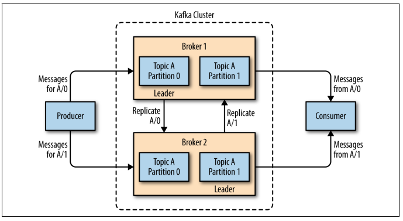
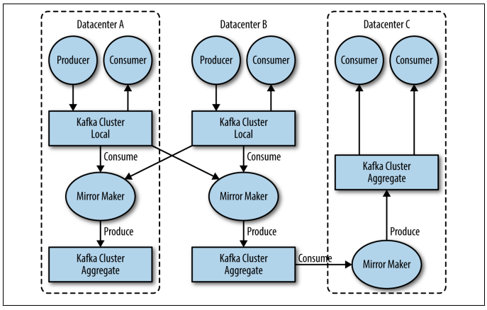
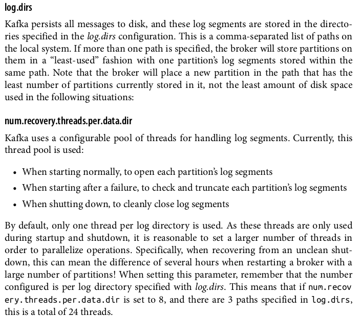

# kafka-interview-preparation
Another one. The book used as the guide for this book was kafka the definitive guide 1st Edition

## Theorical Questions Section

### Theorical Question 1

Do you understand what a broker, a controller and a leader are ?

<b>Answer</b>

A single Kafka server is called a broker. The broker receives messages from producers,
assigns offsets to them, and commits the messages to storage on disk. It also services
consumers, responding to fetch requests for partitions and responding with the mes‐
sages that have been committed to disk. Depending on the specific hardware and its
performance characteristics, a single broker can easily handle thousands of partitions
and millions of messages per second.

Kafka brokers are designed to operate as part of a cluster. Within a cluster of brokers,
one broker will also function as the cluster controller (elected automatically from the
live members of the cluster). The controller is responsible for administrative operations, including assigning partitions to brokers and monitoring for broker failures. A
partition is owned by a single broker in the cluster, and that broker is called the leader
of the partition. A partition may be assigned to multiple brokers, which will result in
the partition being replicated

<b>Source</b>

kafka the definitive guide 1st Edition Pag 7

### Theorical Question 2

Do you know what mirrorMaker is ?

<b>Answer</b>

When working with multiple datacenters in particular, it is often required that mes‐
sages be copied between them. In this way, online applications can have access to user
activity at both sites. For example, if a user changes public information in their pro‐
file, that change will need to be visible regardless of the datacenter in which search
results are displayed. Or, monitoring data can be collected from many sites into a sin‐
gle central location where the analysis and alerting systems are hosted. The replica‐
tion mechanisms within the Kafka clusters are designed only to work within a single
cluster, not between multiple clusters.

The Kafka project includes a tool called MirrorMaker, used for this purpose. At its
core, MirrorMaker is simply a Kafka consumer and producer, linked together with a
queue. Messages are consumed from one Kafka cluster and produced for another.
Figure 1-8 shows an example of an architecture that uses MirrorMaker, aggregating
messages from two local clusters into an aggregate cluster, and then copying that
cluster to other datacenters

<b>Source</b>

kafka the definitive guide 1st Edition Pag 7

### Theorical Question 3

Do you know the config parametes logs.dirs and num.recovery.threads.per.data.dir ?

<b>Answer</b>

<b>Source</b>

kafka the definitive guide 1st Edition Pag 7

