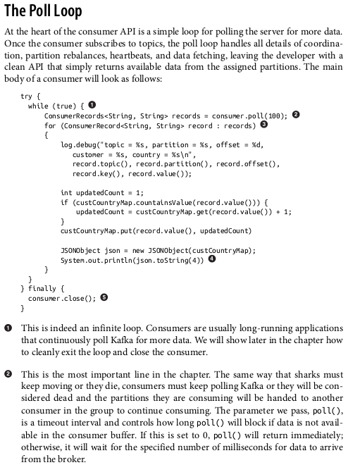

# kafka-interview-preparation
Another one. The book used as the guide for this book was kafka the definitive guide 1st Edition

## Theorical Questions Section

### Theorical Question 1

Do you understand what a broker, a controller and a leader are ?

<b>Answer</b>

A single Kafka server is called a broker. The broker receives messages from producers,
assigns offsets to them, and commits the messages to storage on disk. It also services
consumers, responding to fetch requests for partitions and responding with the mes‐
sages that have been committed to disk. Depending on the specific hardware and its
performance characteristics, a single broker can easily handle thousands of partitions
and millions of messages per second.

Kafka brokers are designed to operate as part of a cluster. Within a cluster of brokers,
one broker will also function as the cluster controller (elected automatically from the
live members of the cluster). The controller is responsible for administrative operations, including assigning partitions to brokers and monitoring for broker failures. A
partition is owned by a single broker in the cluster, and that broker is called the leader
of the partition. A partition may be assigned to multiple brokers, which will result in
the partition being replicated

<b>Source</b>

kafka the definitive guide 1st Edition Pag 7

### Theorical Question 2

Do you know what mirrorMaker is ?

<b>Answer</b>

When working with multiple datacenters in particular, it is often required that mes‐
sages be copied between them. In this way, online applications can have access to user
activity at both sites. For example, if a user changes public information in their pro‐
file, that change will need to be visible regardless of the datacenter in which search
results are displayed. Or, monitoring data can be collected from many sites into a sin‐
gle central location where the analysis and alerting systems are hosted. The replica‐
tion mechanisms within the Kafka clusters are designed only to work within a single
cluster, not between multiple clusters.

The Kafka project includes a tool called MirrorMaker, used for this purpose. At its
core, MirrorMaker is simply a Kafka consumer and producer, linked together with a
queue. Messages are consumed from one Kafka cluster and produced for another.
Figure 1-8 shows an example of an architecture that uses MirrorMaker, aggregating
messages from two local clusters into an aggregate cluster, and then copying that
cluster to other datacenters

<b>Source</b>

kafka the definitive guide 1st Edition Pag 7

### Theorical Question 3

Do you know the config parametes logs.dirs and num.recovery.threads.per.data.dir ?

<b>Answer</b>

<b>Source</b>

kafka the definitive guide 1st Edition Pag 7

### Theorical Question 4

Do you understand why we need a smaller size of the messages ?

<b>Answer</b>

The Kafka broker limits the maximum size of a message that can be produced, con‐
figured by the message.max.bytes parameter, which defaults to 1000000, or 1 MB. A
producer that tries to send a message larger than this will receive an error back from
the broker, and the message will not be accepted. As with all byte sizes specified on
the broker, this configuration deals with compressed message size, which means that
producers can send messages that are much larger than this value uncompressed,
provided they compress to under the configured message.max.bytes size.

There are noticeable performance impacts from increasing the allowable message
size. Larger messages will mean that the broker threads that deal with processing net‐
work connections and requests will be working longer on each request. Larger mes‐
sages also increase the size of disk writes, which will impact I/O throughput.

<b>Source</b>

kafka the definitive guide 1st Edition Pag 28

### Theorical Question 5

Do you know why we include the key with the topic we are writting to ?

<b>Answer</b>

.......

<b>Source</b>

kafka the definitive guide 1st Edition Pag 28

### Theorical Question 6

Do you know what sending messages in Fire-and-forget mean ?

<b>Answer</b>

We send a message to the server and don’t really care if it arrives succesfully or
not. Most of the time, it will arrive successfully, since Kafka is highly available
and the producer will retry sending messages automatically. However, some mes‐
sages will get lost using this method.

<b>Source</b>

kafka the definitive guide 1st Edition Pag 45 

### Theorical Question 7

Do you know what Synchronous send and Asynchronous send mean ?

<b>Answer</b>

Synchronous send: We send a message, the send() method returns a Future object, and we use ge()
to wait on the future and see if the send() was successful or not.

Asynchronous send: We call the send() method with a callback function, which gets triggered when it receives a response from the Kafka broker.

<b>Source</b>

kafka the definitive guide 1st Edition Pag 45 

### Theorical Question 8

Do you know what acks are ?

<b>Answer</b>

The acks parameter controls how many partition replicas must receive the record
before the producer can consider the write successful. This option has a significant
impact on how likely messages are to be lost. There are three allowed values for the
acks parameter:

If acks=0 , the producer will not wait for a reply from the broker before assuming
the message was sent successfully. This means that if something went wrong and the broker did not receive the message, the producer will not know about it and
the message will be lost. However, because the producer is not waiting for any
response from the server, it can send messages as fast as the network will support,
so this setting can be used to achieve very high throughput.

If acks=1 , the producer will receive a success response from the broker the
moment the leader replica received the message. If the message can’t be written
to the leader (e.g., if the leader crashed and a new leader was not elected yet), the
producer will receive an error response and can retry sending the message,
avoiding potential loss of data. The message can still get lost if the leader crashes
and a replica without this message gets elected as the new leader (via unclean
leader election). In this case, throughput depends on whether we send messages
synchronously or asynchronously. If our client code waits for a reply from the
server (by calling the get() method of the Future object returned when sending
a message) it will obviously increase latency significantly (at least by a network
roundtrip). If the client uses callbacks, latency will be hidden, but throughput will
be limited by the number of in-flight messages (i.e., how many messages the pro‐
ducer will send before receiving replies from the server).

If acks=all , the producer will receive a success response from the broker once all
in-sync replicas received the message. This is the safest mode since you can make
sure more than one broker has the message and that the message will survive
even in the case of crash (more information on this in Chapter 5). However, the
latency we discussed in the acks=1 case will be even higher, since we will be wait‐
ing for more than just one broker to receive the message.

<b>Source</b>

kafka the definitive guide 1st Edition Pag 45 

### Theorical Question 9

Do you understand why we use Apache Avro along with kafka ?

<b>Answer</b>

Apache Avro is a language-neutral data serialization format. The project was created
by Doug Cutting to provide a way to share data files with a large audience.

Avro data is described in a language-independent schema. The schema is usually
described in JSON and the serialization is usually to binary files, although serializing
to JSON is also supported. Avro assumes that the schema is present when reading and
writing files, usually by embedding the schema in the files themselves.

One of the most interesting features of Avro, and what makes it a good fit for use in a
messaging system like Kafka, is that when the application that is writing messages
switches to a new schema, the applications reading the data can continue processing
messages without requiring any change or update.

<b>Source</b>

kafka the definitive guide 1st Edition Pag 54

### Theorical Question 10

Do you understand what is poll ?

<b>Answer</b>

<b>Source</b>

kafka the definitive guide 1st Edition Pag 54

### Theorical Question 11

Do you know what a commit is ?

<b>Answer</b>

allows consumers to use Kafka to track their position (offset) in each partition.
We call the action of updating the current position in the partition a commit.

How does a consumer commit an offset? It produces a message to Kafka, to a special
__consumer_offsets topic, with the committed offset for each partition.

<b>Source</b>

kafka the definitive guide 1st Edition Pag 75

### Theorical Question 12

Do you understand the difference between commitSync() and commitAsync() ?

<b>Answer</b>

By setting auto.commit.offset=false , offsets will only be committed when the
application explicitly chooses to do so. The simplest and most reliable of the commit
APIs is commitSync() . This API will commit the latest offset returned by poll() and
return once the offset is committed, throwing an exception if commit fails for some
reason.

It is important to remember that commitSync() will commit the latest offset returned
by poll() , so make sure you call commitSync() after you are done processing all the
records in the collection, or you risk missing messages as described previously. When
rebalance is triggered, all the messages from the beginning of the most recent batch
until the time of the rebalance will be processed twice.

One drawback of manual commit is that the application is blocked until the broker
responds to the commit request. This will limit the throughput of the application.
Throughput can be improved by committing less frequently, but then we are increas‐
ing the number of potential duplicates that a rebalance will create.

The drawback is that while commitSync() will retry the commit until it either succeeds or encounters a nonretriable failure, commitAsync() will not retry. The reason
it does not retry is that by the time commitAsync() receives a response from the
server, there may have been a later commit that was already successful. Imagine that
we sent a request to commit offset 2000.

A simple pattern to get commit order right for asynchronous retries is to use a monotonically increasing sequence number. Increase the sequence number every time you commit and add the
sequence number at the time of the commit to the commitAsync callback. When you’re getting ready to send a retry, check if the commit sequence number the callback got is equal to the instance variable;
 
if it is, there was no newer commit and it is safe to retry. If the instance sequence number is higher, don’t retry because a newer commit was already sent.

<b>Source</b>

kafka the definitive guide 1st Edition Pag 101

